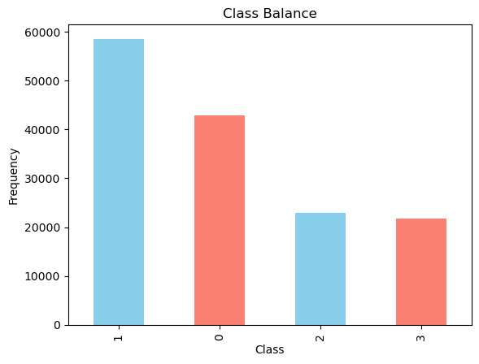
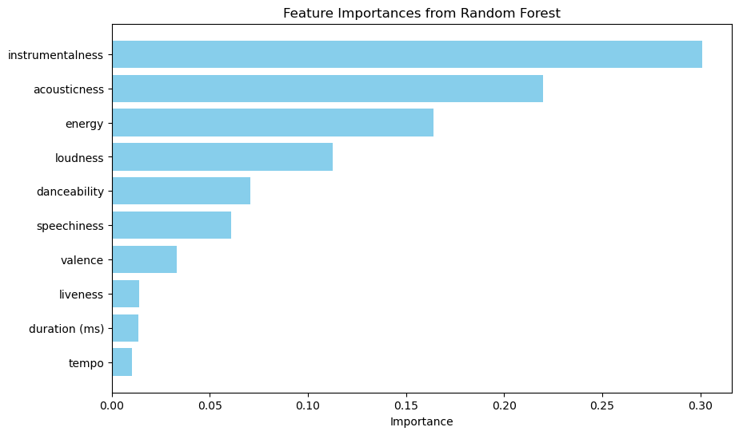
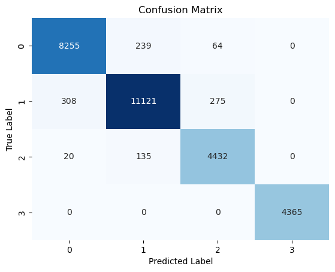

# Spotify Song Mood Classification Project

## Introduction

This project aims to train a machine learning classifier to label a set of songs based on their audio features into different moods: sad, happy, energetic, and calm. The goal is to improve song classification for creating more personalized playlists and suggestions according to the user's desired mood.

## Datasets

- [278k Emotion Labeled Spotify Songs](https://www.kaggle.com/datasets/abdullahorzan/moodify-dataset?select=278k_labelled_uri.csv): The main labeled dataset containing songs with audio features.
- [6K Spotify Playlists](https://www.kaggle.com/datasets/viktoriiashkurenko/278k-spotify-songs?select=main_dataset.csv): This dataset includes metadata for the 278k songs mentioned above, but without labels.
- [Billboard Hot 100 For 08/31/24 (with Spotify Data)](https://www.kaggle.com/datasets/thebumpkin/billboard-hot-100-for-083124-with-spotify-data): A set of popular songs without labels, used to test the classifier with completely unseen data.

## Exploratory Data Analysis

1. Download the [278k Emotion Labeled Spotify Songs](https://www.kaggle.com/datasets/abdullahorzan/moodify-dataset?select=278k_labelled_uri.csv) and the [6K Spotify Playlists](https://www.kaggle.com/datasets/viktoriiashkurenko/278k-spotify-songs?select=main_dataset.csv). These files are large, so they are not included in the repository.

2. Run the [eda.ipynb](eda.ipynb) notebook to merge the two main datasets, creating a labeled dataset with audio features and song metadata.

3. Records with null values were removed, and outliers for each class were also excluded, resulting in a dataset with 146k records for model training.

4. A class imbalance was identified and addressed during model training by applying oversampling.

## Labels

Labels: {'sad': 0, 'happy': 1, 'energetic': 2, 'calm': 3}

## Classification Model

The model was trained using the following audio features:

- energy
- danceability
- loudness
- acousticness
- instrumentalness
- valence
- speechiness
- tempo
- duration
- liveness 

By analyzing the features with side-by-side boxplots and calculating their mutual information, we identified three features that did not significantly differentiate between classes: duration, liveness, and tempo.

We initially trained three models to select the best-performing one: logistic regression (baseline), k-NN, and random forest. The random forest model showed the best performance, so we proceeded with further analysis using this model.

The model was trained with all the audio features and again without the three least important features to compare performance differences.

| Features Used                   | Accuracy | Precision | Recall | F1-Score | ROC-AUC Score |
|---------------------------------|----------|-----------|--------|----------|---------------|
| All features                    | 0.973    | 0.973     | 0.973  | 0.973    | 0.999         |
| Without duration, liveness, and tempo | 0.964    | 0.965     | 0.964  | 0.964    | 0.998         |

As shown in the table above, the performance difference is marginal when removing the less important features. Additionally, the feature importance calculated by our random forest classifier also identifies duration, liveness, and tempo as the least important features. Therefore, we decided to remove them, which led to better generalization and reduced the chances of overfitting by simplifying the model.

## Results

The trained random forest classifier achieved excellent performance with an F1-score of 0.964. We tested the classifier with a set of unlabeled songs from 2024. Since our dataset only contains data up to 2023, this new data was completely unseen. It is generally challenging to distinguish between songs classified as energetic or happy and also those classified as sad or calm, which is also reflected in the confusion matrix shown below.

Labels: {'sad': 0, 'happy': 1, 'energetic': 2, 'calm': 3}